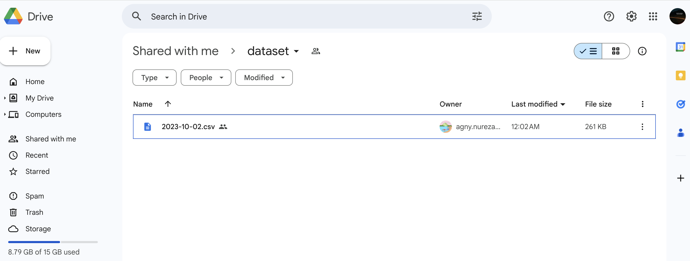
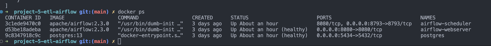
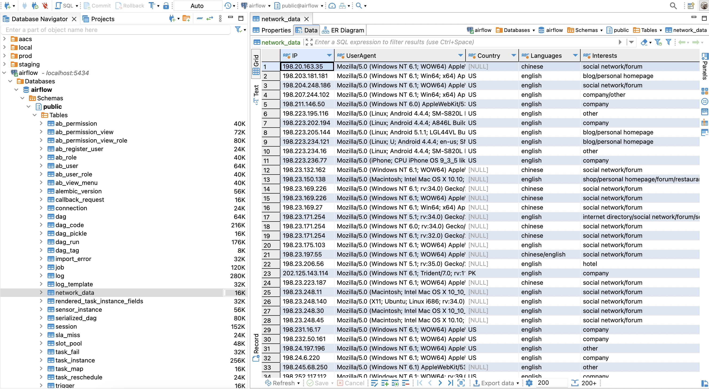

# ETL-Airflow-Gdrive-to-PostgreSql

ETL process used python as main programming language and airflow

_Picture 1: Prepare Dataset 

_Picture 2: Docker ps 

_Picture 3: Network Docker PostgreSql 

_Picture 4: Final Result Insert Data